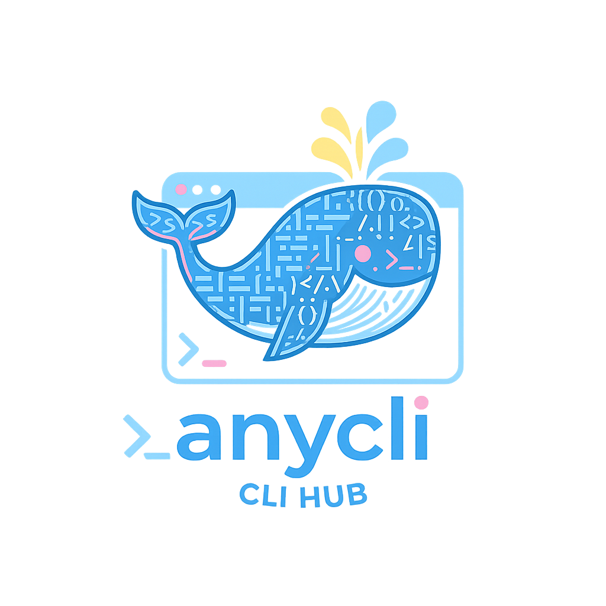
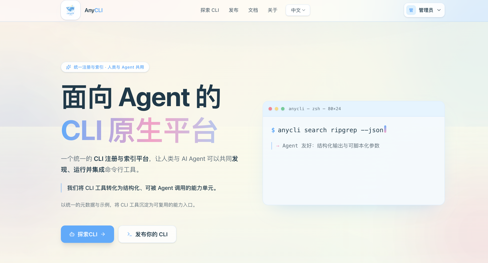
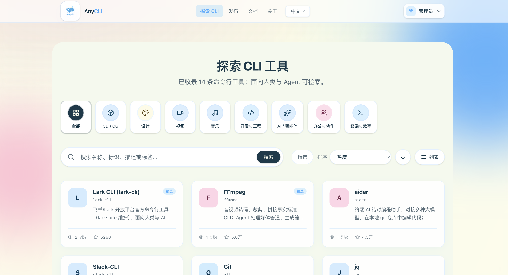
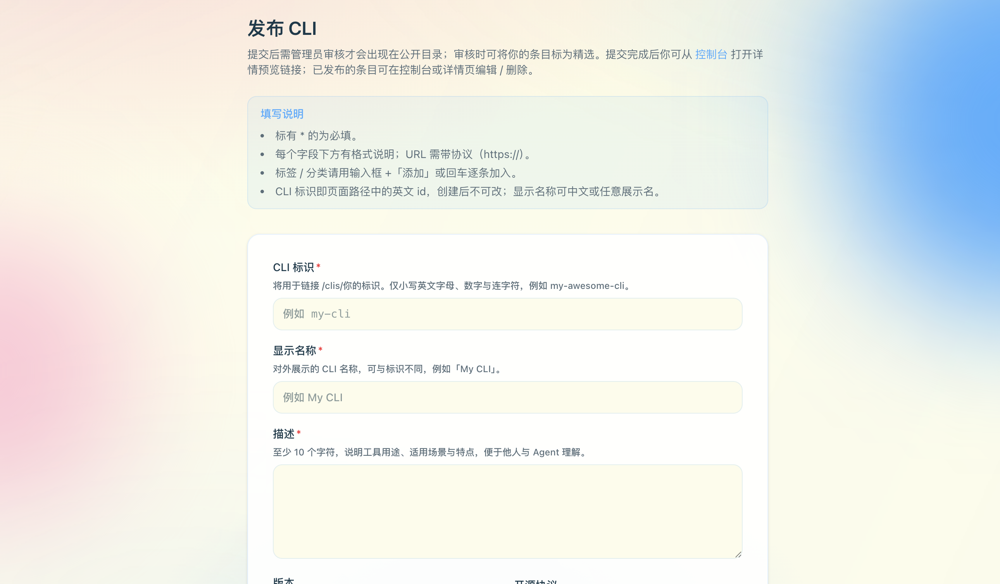
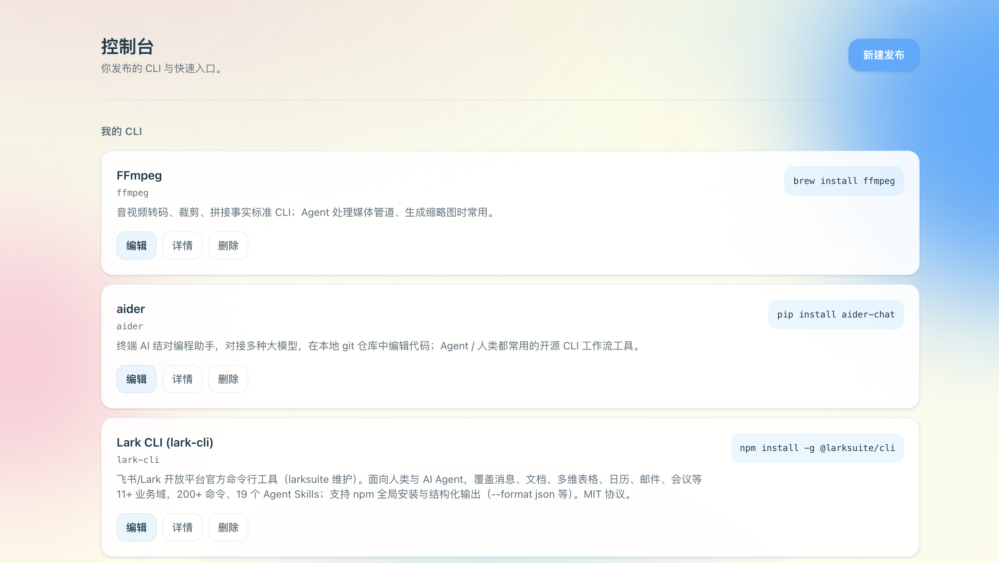

<div align="center">
  

  <h1>🚀 AnyCLI</h1>
  <p><strong>Agent-native CLI platform</strong></p>
  <p><em>Turn every CLI tool into an AI-agent-callable capability unit</em></p>

  <p>
    <a href="https://www.npmjs.com/package/@lightcity/anycli"></a>
    <a href="https://github.com/datawhalechina/anycli/stargazers"></a>
    <a href="https://github.com/datawhalechina/anycli/blob/main/LICENSE"></a>
    <a href="https://github.com/datawhalechina/anycli/issues"></a>
    <a href="https://github.com/datawhalechina/anycli/pulls"></a>
  </p>

  <p>
    <a href="README.md">简体中文</a> | <a href="http://anycli.linklearner.com/">🌐 Live Demo</a>
  </p>

  <p>
    <a href="#-quick-start">⚡ Quick Start</a> ·
    <a href="#-key-features">✨ Features</a> ·
    <a href="#-screenshots">📸 Screenshots</a> ·
    <a href="#-how-agents-use-it">🤖 Agent Usage</a> ·
    <a href="#-development">🔧 Development</a>
  </p>
</div>

---

## 💡 What is this

> **AnyCLI = Unified CLI registry + AI Agent capability dispatch layer**

Traditional CLI tools are scattered across different package managers with varying install methods and inconsistent docs. AnyCLI unifies them so AI Agents can **search, install, and invoke** any CLI tool in one sentence.

<table>
<tr>
<td width="50%">

### 🏗️ Unified Platform
- Unified registry & index for CLI tools
- Explore / Publish / Detail / Docs pages
- Structured metadata: install method, binary name, examples, agent hints

</td>
<td width="50%">

### 🤖 Agent Native
- `anycli search/install --json` for structured JSON
- Agents "talk to AnyCLI only" — downstream differences abstracted away
- Safety first: dry-run by default, execute only when confirmed

</td>
</tr>
</table>

## ⚡ Quick Start

```bash
# Install AnyCLI globally
npm i -g @lightcity/anycli

# Search for a tool → structured JSON
anycli search <slug> --json

# Install (dry-run by default — shows command, doesn't execute)
anycli install <slug> --json

# Execute installation after confirming safety
anycli install <slug> --yes --json
```

## ✨ Key Features

| Feature | Description |
| :---: | --- |
| 🔍 **Unified Search** | One command to search all registered CLI tools, returns structured JSON |
| 📦 **Unified Install** | Abstracts away brew / npm / pip / script differences |
| 🛡️ **Safety First** | Dry-run by default — agent gets the command first, human/policy confirms |
| 🧩 **Metadata Driven** | Install method, binary, examples, agent hints — standardized capability entry |
| 🌐 **Web Platform** | Explore, publish, and manage CLI tools online |

## 📸 Screenshots

> 🔗 **Live Demo**: [anycli.linklearner.com](http://anycli.linklearner.com/)

<table>
<tr>
<td width="50%" align="center">
<strong>Home</strong><br/>

</td>
<td width="50%" align="center">
<strong>Search / Explore</strong><br/>

</td>
</tr>
<tr>
<td width="50%" align="center">
<strong>Publish</strong><br/>

</td>
<td width="50%" align="center">
<strong>Admin</strong><br/>

</td>
</tr>
</table>

## 🤖 How Agents Use It

Core agent flow: **search → structured JSON → install (dry-run) → confirm → execute**.

### Prompt Template (paste directly into your AI Agent)

```text
Please install and verify a CLI tool using AnyCLI safely. Follow these steps:
1) Make sure AnyCLI is installed:
   npm i -g @lightcity/anycli
2) Search for the tool:
   anycli search {{slug}} --json
3) Review the output and check example_usage. Pick the safest command for verification.
4) Install the tool safely:
   anycli install {{slug}} --json   # confirm this command is safe
   anycli install {{slug}} --yes    # execute installation
5) Run a minimal verification command to ensure the tool works
   (e.g., <binary> --help or a safe command from example_usage).
6) Summarize the output of the verification command.
```

> 📖 For more templates, see [`/docs`](http://anycli.linklearner.com/docs) on the website.

## 🌐 Website Pages

| Page | Path | Description |
| --- | --- | --- |
| 🔍 Explore | [`/clis`](http://anycli.linklearner.com/clis) | Browse all registered CLI tools |
| 📤 Publish | [`/publish`](http://anycli.linklearner.com/publish) | Submit a new tool (requires admin review) |
| 📖 Docs | [`/docs`](http://anycli.linklearner.com/docs) | Agent-first usage guide + prompt templates |
| ℹ️ About | [`/about`](http://anycli.linklearner.com/about) | Project info |

## 🔧 Development

See [DEVELOPMENT.md](DEVELOPMENT.md).

## �� License

This project is open-sourced under the [MIT License](LICENSE).

---

<div align="center">
  <p>
    <sub>Built with ❤️ by the <a href="https://github.com/datawhalechina">Datawhale</a> community</sub>
  </p>
</div>
